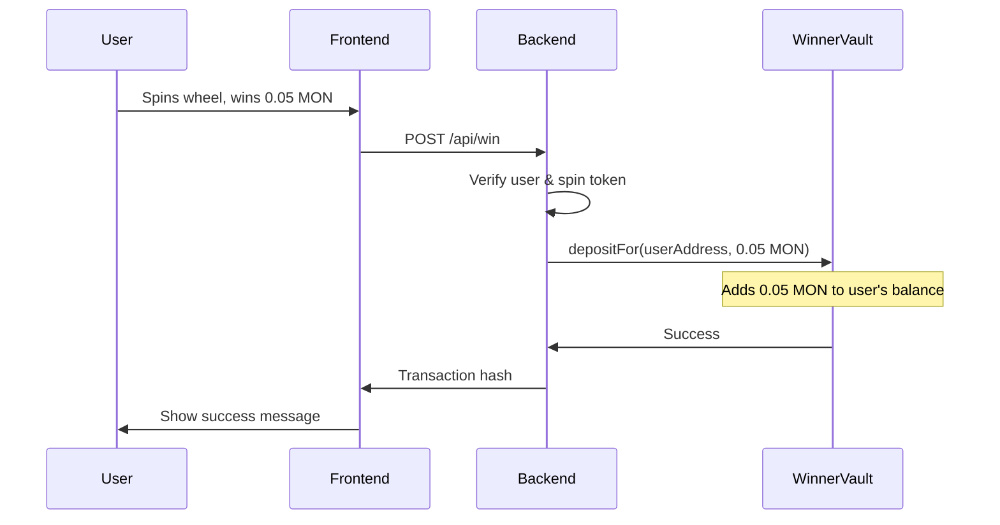
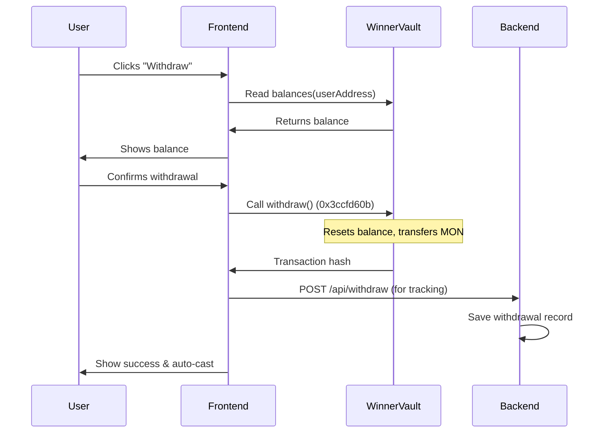

# WinnerVault Contract Documentation

## Overview

The **WinnerVault** contract is a simple vault that holds MON tokens for game winners. When users win in the spin game, the backend deposits MON into this contract on their behalf. Users can then withdraw their accumulated winnings at any time.

## Contract Features

### Core Functionality

1. **depositFor(address user, uint256 amount)** - Deposits MON for a specific user
   - Called by backend wallets when users win
   - Requires `msg.value == amount`
   - Updates user's balance mapping
   - Emits `Deposited` event

2. **withdraw()** - Allows users to withdraw their entire balance
   - Function selector: `0x3ccfd60b`
   - Called directly by users from the frontend
   - Resets balance before transfer (reentrancy protection)
   - Transfers all accumulated winnings to the caller
   - Emits `Withdrawn` event

3. **balances(address)** - Public mapping to view user balances
   - Returns the balance for any address
   - Used by frontend to display pending withdrawals

### Admin Functions

4. **transferOwnership(address newOwner)** - Transfer contract ownership
5. **emergencyWithdraw()** - Emergency function for owner to withdraw all funds

## How It Works

### Winning Flow (Backend → Contract)



**Code in `pages/api/win.ts`:**
```typescript
// Line 24-26: ABI definition
const ABI = [
  "function depositFor(address user, uint256 amount) external"
];

// Line 362: Create contract instance
const contract = new ethers.Contract(CONTRACT_ADDRESS, ABI, wallet);

// Line 380: Send MON to vault for user
const tx = await contract.depositFor(to, amountInWei, { value: amountInWei });
```

### Withdrawal Flow (User → Contract)



**Code in `components/Home/InnerWallet.tsx`:**
```typescript
// Line 18-20: ABI definition
const abi = parseAbi([
  "function balances(address) view returns (uint256)"
]);

// Line 40-45: Read user's balance
const { data } = useReadContract({
  address: CONTRACT_ADDRESS,
  abi,
  functionName: 'balances',
  args: [address],
});

// Line 125-128: Withdraw transaction
await sendTransaction({
  to: CONTRACT_ADDRESS,
  data: "0x3ccfd60b", // Function selector for withdraw()
});
```

## Deployment Instructions

### Prerequisites
- Hardhat or Foundry installed
- monad mainnet RPC URL
- Private key with MON for gas fees

### Using Hardhat

1. Install Hardhat:
```bash
npm install --save-dev hardhat @nomicfoundation/hardhat-toolbox
```

2. Create `hardhat.config.ts`:
```typescript
import { HardhatUserConfig } from "hardhat/config";
import "@nomicfoundation/hardhat-toolbox";

const config: HardhatUserConfig = {
  solidity: {
    version: "0.8.20",
    settings: {
      optimizer: {
        enabled: true,
        runs: 200
      }
    }
  },
  networks: {
    monadTestnet: {
      url: process.env.MONAD_RPC_URL || "",
      accounts: process.env.DEPLOYER_PRIVATE_KEY ? [process.env.DEPLOYER_PRIVATE_KEY] : [],
      chainId: 41454, // monad mainnet chain ID
    }
  }
};

export default config;
```

3. Create deployment script `scripts/deploy-vault.ts`:
```typescript
import { ethers } from "hardhat";

async function main() {
  console.log("Deploying WinnerVault...");

  const WinnerVault = await ethers.getContractFactory("WinnerVault");
  const vault = await WinnerVault.deploy();

  await vault.waitForDeployment();
  const address = await vault.getAddress();

  console.log(`✅ WinnerVault deployed to: ${address}`);
  console.log(`\nAdd this to your .env.local:`);
  console.log(`NEXT_PUBLIC_WINNER_VAULT_ADDRESS=${address}`);
}

main()
  .then(() => process.exit(0))
  .catch((error) => {
    console.error(error);
    process.exit(1);
  });
```

4. Deploy:
```bash
npx hardhat run scripts/deploy-vault.ts --network monadTestnet
```

### Using Foundry

1. Install Foundry:
```bash
curl -L https://foundry.paradigm.xyz | bash
foundryup
```

2. Initialize project (if needed):
```bash
forge init
```

3. Deploy:
```bash
forge create --rpc-url $MONAD_RPC_URL \
  --private-key $DEPLOYER_PRIVATE_KEY \
  contracts/WinnerVault.sol:WinnerVault
```

## Testing the Contract

### Local Testing with Hardhat

Create `test/WinnerVault.test.ts`:
```typescript
import { expect } from "chai";
import { ethers } from "hardhat";
import { WinnerVault } from "../typechain-types";
import { SignerWithAddress } from "@nomicfoundation/hardhat-ethers/signers";

describe("WinnerVault", function () {
  let vault: WinnerVault;
  let owner: SignerWithAddress;
  let winner1: SignerWithAddress;
  let winner2: SignerWithAddress;
  let depositor: SignerWithAddress;

  beforeEach(async function () {
    [owner, winner1, winner2, depositor] = await ethers.getSigners();
    
    const WinnerVault = await ethers.getContractFactory("WinnerVault");
    vault = await WinnerVault.deploy();
    await vault.waitForDeployment();
  });

  describe("Deployment", function () {
    it("Should set the right owner", async function () {
      expect(await vault.owner()).to.equal(owner.address);
    });

    it("Should start with zero balances", async function () {
      expect(await vault.balances(winner1.address)).to.equal(0);
    });
  });

  describe("Deposits", function () {
    it("Should deposit MON for a user", async function () {
      const amount = ethers.parseEther("0.05");
      
      await expect(
        vault.connect(depositor).depositFor(winner1.address, amount, { value: amount })
      ).to.emit(vault, "Deposited")
        .withArgs(winner1.address, amount, depositor.address);
      
      expect(await vault.balances(winner1.address)).to.equal(amount);
    });

    it("Should reject deposit with wrong msg.value", async function () {
      const amount = ethers.parseEther("0.05");
      const wrongValue = ethers.parseEther("0.03");
      
      await expect(
        vault.connect(depositor).depositFor(winner1.address, amount, { value: wrongValue })
      ).to.be.revertedWith("Sent value must equal amount");
    });

    it("Should accumulate multiple deposits", async function () {
      const amount1 = ethers.parseEther("0.05");
      const amount2 = ethers.parseEther("0.03");
      
      await vault.connect(depositor).depositFor(winner1.address, amount1, { value: amount1 });
      await vault.connect(depositor).depositFor(winner1.address, amount2, { value: amount2 });
      
      expect(await vault.balances(winner1.address)).to.equal(amount1 + amount2);
    });
  });

  describe("Withdrawals", function () {
    beforeEach(async function () {
      const amount = ethers.parseEther("0.1");
      await vault.connect(depositor).depositFor(winner1.address, amount, { value: amount });
    });

    it("Should allow user to withdraw their balance", async function () {
      const initialBalance = await ethers.provider.getBalance(winner1.address);
      const vaultBalance = await vault.balances(winner1.address);
      
      const tx = await vault.connect(winner1).withdraw();
      const receipt = await tx.wait();
      const gasUsed = receipt!.gasUsed * receipt!.gasPrice;
      
      const finalBalance = await ethers.provider.getBalance(winner1.address);
      
      expect(finalBalance).to.equal(initialBalance + vaultBalance - gasUsed);
      expect(await vault.balances(winner1.address)).to.equal(0);
    });

    it("Should emit Withdrawn event", async function () {
      const amount = await vault.balances(winner1.address);
      
      await expect(vault.connect(winner1).withdraw())
        .to.emit(vault, "Withdrawn")
        .withArgs(winner1.address, amount);
    });

    it("Should reject withdrawal with no balance", async function () {
      await expect(
        vault.connect(winner2).withdraw()
      ).to.be.revertedWith("No balance to withdraw");
    });

    it("Should prevent double withdrawal", async function () {
      await vault.connect(winner1).withdraw();
      
      await expect(
        vault.connect(winner1).withdraw()
      ).to.be.revertedWith("No balance to withdraw");
    });
  });

  describe("Balance queries", function () {
    it("Should return correct balance", async function () {
      const amount = ethers.parseEther("0.05");
      await vault.connect(depositor).depositFor(winner1.address, amount, { value: amount });
      
      expect(await vault.getBalance(winner1.address)).to.equal(amount);
    });

    it("Should return correct contract balance", async function () {
      const amount1 = ethers.parseEther("0.05");
      const amount2 = ethers.parseEther("0.03");
      
      await vault.connect(depositor).depositFor(winner1.address, amount1, { value: amount1 });
      await vault.connect(depositor).depositFor(winner2.address, amount2, { value: amount2 });
      
      expect(await vault.getContractBalance()).to.equal(amount1 + amount2);
    });
  });

  describe("Ownership", function () {
    it("Should transfer ownership", async function () {
      await expect(vault.connect(owner).transferOwnership(winner1.address))
        .to.emit(vault, "OwnershipTransferred")
        .withArgs(owner.address, winner1.address);
      
      expect(await vault.owner()).to.equal(winner1.address);
    });

    it("Should reject ownership transfer from non-owner", async function () {
      await expect(
        vault.connect(winner1).transferOwnership(winner2.address)
      ).to.be.revertedWith("Only owner can call this function");
    });
  });

  describe("Emergency withdraw", function () {
    beforeEach(async function () {
      const amount = ethers.parseEther("0.5");
      await vault.connect(depositor).depositFor(winner1.address, amount, { value: amount });
    });

    it("Should allow owner to emergency withdraw", async function () {
      const contractBalance = await vault.getContractBalance();
      const ownerInitialBalance = await ethers.provider.getBalance(owner.address);
      
      const tx = await vault.connect(owner).emergencyWithdraw();
      const receipt = await tx.wait();
      const gasUsed = receipt!.gasUsed * receipt!.gasPrice;
      
      const ownerFinalBalance = await ethers.provider.getBalance(owner.address);
      
      expect(ownerFinalBalance).to.equal(ownerInitialBalance + contractBalance - gasUsed);
      expect(await vault.getContractBalance()).to.equal(0);
    });

    it("Should reject emergency withdraw from non-owner", async function () {
      await expect(
        vault.connect(winner1).emergencyWithdraw()
      ).to.be.revertedWith("Only owner can call this function");
    });
  });
});
```

Run tests:
```bash
npx hardhat test
```

## Environment Variables

Add the deployed contract address to your `.env.local`:

```env
# WinnerVault Contract
NEXT_PUBLIC_WINNER_VAULT_ADDRESS=0xYourDeployedContractAddress

# Backend wallets (for depositFor calls)
WALLET_PRIVATE_KEY_1=your_backend_wallet_key_1
WALLET_PRIVATE_KEY_2=your_backend_wallet_key_2
# ... add more as needed

# RPC
MONAD_RPC_URL=https://your-monad-rpc-url
```

## Security Considerations

1. **Reentrancy Protection**: The `withdraw()` function follows the checks-effects-interactions pattern, resetting the balance before transferring funds.

2. **Access Control**: Only the owner can call emergency functions.

3. **Input Validation**: All functions validate inputs (non-zero addresses, positive amounts).

4. **Balance Verification**: `depositFor()` requires exact `msg.value` to prevent accounting errors.

5. **Backend Wallets**: Use multiple private keys for load balancing and security (WALLET_PRIVATE_KEY_1 through 10).

## Monitoring & Maintenance

### View Contract State

```typescript
// Check a user's balance
const balance = await vaultContract.balances(userAddress);

// Check total contract balance
const total = await vaultContract.getContractBalance();

// Check owner
const owner = await vaultContract.owner();
```

### Events to Monitor

- **Deposited**: Track all winnings deposited
- **Withdrawn**: Track all user withdrawals
- **OwnershipTransferred**: Monitor ownership changes

### Common Issues

1. **User can't withdraw**: Check if they're on the correct network (monad mainnet, chainId: 41454)
2. **Deposit fails**: Ensure backend wallet has sufficient MON for gas + winning amount
3. **Balance shows 0**: Refresh the page or check the contract directly on block explorer

## Contract Verification

After deployment, verify on Monad Explorer:

```bash
npx hardhat verify --network monadTestnet DEPLOYED_CONTRACT_ADDRESS
```

## Upgrading

This contract is not upgradeable. To upgrade:
1. Deploy a new version
2. Use `emergencyWithdraw()` to recover funds from old contract
3. Update `NEXT_PUBLIC_WINNER_VAULT_ADDRESS` in environment variables
4. Optionally migrate user balances to new contract

## Support

For issues or questions:
- Check transaction on Monad Explorer
- Review contract events
- Contact developer via Farcaster (FID: 249702)
